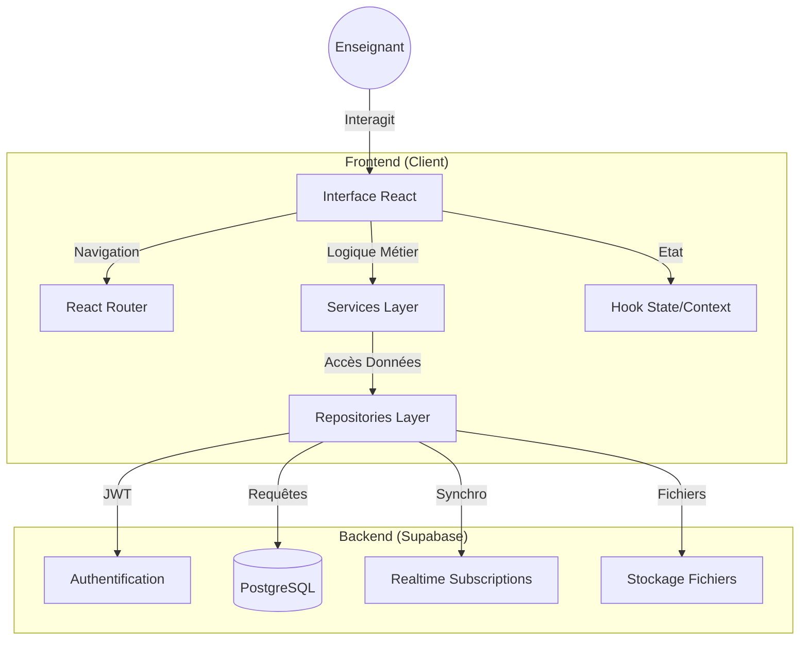

# Architecture du Projet Gestion de Classe

Ce document décrit l'architecture technique de l'application de Gestion de Classe.

## Vue d'ensemble

Le projet est une Single Page Application (SPA) construite avec React et Vite, utilisant Supabase comme Backend-as-a-Service (BaaS). L'architecture suit le **Repository Pattern** pour une séparation claire des responsabilités entre la logique métier et l'accès aux données.



## Technologies

- **Frontend**:
  - [React](https://react.dev/) 19.2 (UI)
  - [Vite](https://vitejs.dev/) 5.4 (Build tool)
  - [TypeScript](https://www.typescriptlang.org/) 5.9 (Type safety)
  - [Tailwind CSS](https://tailwindcss.com/) 4.1 (Styling)
  - [React Router](https://reactrouter.com/) 6.30 (Navigation)
  - [Lucide React](https://lucide.dev/) (Icônes)
  - [DnD Kit](https://dndkit.com/) (Drag & Drop)
  - [Vitest](https://vitest.dev/) 4.0 (Testing)

- **Backend**:
  - [Supabase](https://supabase.com/)
    - PostgreSQL Database (Relationnelle)
    - Authentication (Email-based)
    - Row Level Security (RLS) pour la sécurité des données
    - Real-time subscriptions pour la synchro instantanée
    - File storage pour les photos et documents

## Architecture en Couches

### 1. Presentation Layer (Components)

Composants React réutilisables, gestion de l'état local et interaction utilisateur.

### 2. Business Logic Layer (Services)

Validation des données, orchestration des opérations et logique métier centralisée. Utilise l'injection de dépendances pour les repositories.

### 3. Data Access Layer (Repositories)

Abstraction de la source de données. Isole les requêtes Supabase (`supabaseClient`) du reste de l'application.

### 4. Infrastructure Layer (Lib)

Utilitaires partagés, configuration globale, helpers et synchronisation.

## Structure des Dossiers

```text
/src
├── /components          # Composants UI globaux et Layouts
├── /pages              # Composants de pages (entry point des routes)
├── /features           # Architecture orientée "domaines métier"
│   ├── /activities     # Gestion des activités pédagogiques
│   ├── /attendance     # Gestion des présences
│   ├── /branches       # Gestion des branches et sous-branches
│   ├── /classes        # Gestion des classes/divisions
│   ├── /groups         # Gestion des groupes d'élèves
│   ├── /levels         # Gestion des niveaux (PS, MS, GS, etc.)
│   ├── /materials      # Gestion du matériel de classe
│   ├── /modules        # Modules de progression
│   ├── /planner        # Planning et emploi du temps
│   ├── /progression    # Suivi des acquis
│   ├── /students       # Fiches élèves et photos
│   ├── /tracking       # Suivi pédagogique détaillé
│   └── /users          # Profils et paramètres utilisateurs
├── /lib                # Coeur technique (Supabase, Storage, PDF, Sync)
├── /hooks              # Hooks React globaux (useAuth, useToast, etc.)
├── /config             # Constantes et configuration globale
└── /types              # Définitions de types TypeScript (dont supabase.ts)
```

## Patterns Architecturaux

### Repository Pattern

L'application utilise le Repository Pattern pour découpler le code métier des détails de Supabase.

**Exemple de structure :**

- `IStudentRepository.ts` : Définit l'interface (le contrat).
- `SupabaseStudentRepository.ts` : Implémente le contrat avec Supabase.
- `StudentService.ts` : Reçoit le repository et gère la logique métier.

### Services Migrés

Presque tous les domaines métier utilisent désormais ce pattern :

- ✅ **AttendanceService**
- ✅ **TrackingService**
- ✅ **StudentService**
- ✅ **ActivityService**
- ✅ **MaterialService**
- ✅ **ClassService / LevelService / BranchService / GroupService**
- ✅ **AdultService**

## Sécurité

- **RLS (Row Level Security)** : Activé sur toutes les tables. Chaque utilisateur ne peut voir que les données liées à son `compte_utilisateur_id`.
- **Authentification** : Gérée exclusivement via Supabase Auth (JWT).

## Documentation Complémentaire

- [TESTING.md](file:///Users/a/Documents/Sites%20webs/SAAS/Gestion_De_Classe/gestion-de-classe/TESTING.md) - Guide de tests
- `supabase/migrations/` - Historique de la structure de base de données

---

**Dernière mise à jour :** 25 Janvier 2026
**Version :** 1.1.0  
**Statut :** ✅ Architecture stable et documentée
