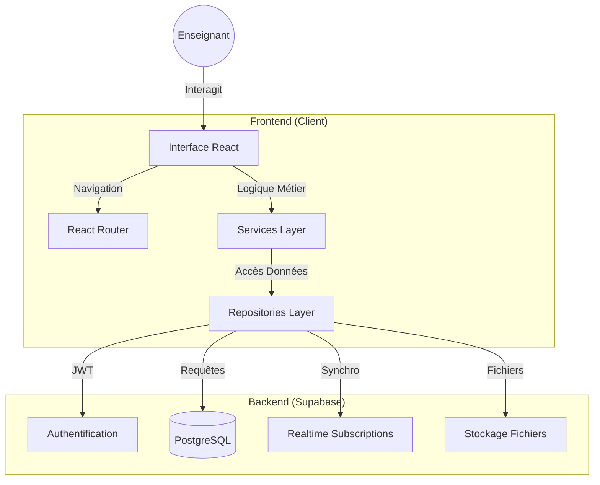

# Architecture du Projet Gestion de Classe

Ce document décrit l'architecture technique de l'application de Gestion de Classe.

## Vue d'ensemble

Le projet est une Single Page Application (SPA) construite avec React et Vite, utilisant Supabase comme Backend-as-a-Service (BaaS). L'architecture suit le **Repository Pattern** pour une séparation claire des responsabilités.



## Technologies

- **Frontend**:
  - [React](https://react.dev/) 19.2 (UI)
  - [Vite](https://vitejs.dev/) 5.4 (Build tool)
  - [TypeScript](https://www.typescriptlang.org/) 5.9 (Type safety)
  - [Tailwind CSS](https://tailwindcss.com/) 4.1 (Styling)
  - [React Router](https://reactrouter.com/) 6.30 (Navigation)
  - [Lucide React](https://lucide.dev/) (Icônes)
  - [DnD Kit](https://dndkit.com/) (Drag & Drop)
  - [Vitest](https://vitest.dev/) 4.0 (Testing)

- **Backend**:
  - [Supabase](https://supabase.com/)
    - PostgreSQL Database
    - Authentication (Email-based)
    - Row Level Security (RLS)
    - Real-time subscriptions
    - File storage

## Architecture en Couches

### 1. Presentation Layer (Components)

- Composants React réutilisables
- Gestion de l'état local
- Interaction utilisateur

### 2. Business Logic Layer (Services)

- Validation des données
- Orchestration des opérations
- Logique métier centralisée
- **Pattern :** Dependency Injection

### 3. Data Access Layer (Repositories)

- Abstraction de la source de données
- Requêtes Supabase isolées
- **Pattern :** Repository Pattern

### 4. Infrastructure Layer (Lib)

- Utilitaires partagés
- Configuration
- Helpers

## Structure des Dossiers

```
/src
├── /components          # Composants réutilisables (Layout, Modales, UI)
├── /pages              # Vues principales (Dashboard, Auth, Landing)
├── /features           # Modules métier (feature-based architecture)
│   ├── /attendance     # Gestion des présences
│   │   ├── /components
│   │   ├── /hooks
│   │   ├── /repositories
│   │   │   ├── IAttendanceRepository.ts
│   │   │   └── SupabaseAttendanceRepository.ts
│   │   └── /services
│   │       ├── attendanceService.ts
│   │       └── attendanceService.test.ts
│   ├── /tracking       # Suivi pédagogique
│   │   ├── /types
│   │   ├── /repositories
│   │   └── /services
│   ├── /students       # Gestion des élèves
│   ├── /activities     # Gestion des activités
│   ├── /classes        # Gestion des classes
│   ├── /groups         # Gestion des groupes
│   ├── /levels         # Gestion des niveaux
│   ├── /branches       # Gestion des branches
│   ├── /adults         # Gestion des adultes
│   └── /materials      # Gestion du matériel
├── /lib                # Utilitaires et configuration
│   ├── /storage        # Stockage et images
│   │   ├── storageService.ts
│   │   ├── imageCompression.ts
│   │   ├── photoCache.ts
│   │   └── index.ts
│   ├── /database       # Configuration DB
│   │   ├── supabaseClient.ts
│   │   ├── supabaseQueries.ts
│   │   ├── cleanupUtils.ts
│   │   └── index.ts
│   ├── /helpers        # Utilitaires généraux
│   │   ├── utils.ts
│   │   ├── validation.ts
│   │   ├── statusHelpers.ts
│   │   └── index.ts
│   ├── /sync           # Synchronisation
│   │   ├── deltaSync.ts
│   │   ├── offline.ts
│   │   └── index.ts
│   └── /pdf            # Génération PDF
│       ├── pdfUtils.ts
│       └── index.ts
├── /hooks              # Custom hooks globaux
├── /config             # Constantes globales
└── /types              # Types TypeScript

```

## Patterns Architecturaux

### Repository Pattern

Tous les services critiques utilisent le Repository Pattern pour séparer la logique métier de l'accès aux données.

**Avantages :**

- ✅ Testabilité (mocks faciles)
- ✅ Changement de source de données simplifié
- ✅ Séparation des responsabilités
- ✅ Code plus maintenable

**Exemple :**

```typescript
// Interface (contrat)
export interface IStudentRepository {
  findById(id: string): Promise<Student | null>;
  create(data: StudentInsert): Promise<Student>;
  update(id: string, data: StudentUpdate): Promise<Student>;
}

// Implémentation Supabase
export class SupabaseStudentRepository implements IStudentRepository {
  async findById(id: string) {
    const { data, error } = await supabase
      .from('Eleve')
      .select('*')
      .eq('id', id)
      .single();
    if (error) throw error;
    return data;
  }
  // ...
}

// Service avec injection de dépendances
export class StudentService {
  constructor(private repository: IStudentRepository) {}
  
  async getStudent(id: string) {
    return await this.repository.findById(id);
  }
}

// Singleton exporté
export const studentService = new StudentService(
  new SupabaseStudentRepository()
);
```

### Services Migrés

Les services suivants utilisent le Repository Pattern :

- ✅ **AttendanceService** - Gestion des présences (16 tests)
- ✅ **TrackingService** - Suivi pédagogique (14 tests)
- ✅ **AdultService** - Gestion des adultes (4 tests)
- ✅ **ActivityTypeService** - Types d'activités (10 tests)
- ✅ **MaterialService** - Gestion du matériel (11 tests)
- ✅ **StudentService** - Gestion des élèves
- ✅ **ActivityService** - Gestion des activités
- ✅ **ClassService** - Gestion des classes
- ✅ **LevelService** - Gestion des niveaux
- ✅ **BranchService** - Gestion des branches
- ✅ **GroupService** - Gestion des groupes

**Total : 55 tests unitaires (100% de réussite)**

## Conventions de Code

### Nommage

- **Interfaces Repository :** `I[Entity]Repository`
- **Implémentations :** `Supabase[Entity]Repository`
- **Services :** `[Entity]Service`
- **Instances :** `[entity]Service` (camelCase)

### Structure de Feature

```
/features/[feature-name]/
├── /types              # Types TypeScript spécifiques
├── /components         # Composants UI
├── /hooks              # Hooks personnalisés
├── /repositories       # Accès aux données
│   ├── I[Feature]Repository.ts
│   └── Supabase[Feature]Repository.ts
├── /services           # Logique métier
│   ├── [feature]Service.ts
│   └── [feature]Service.test.ts
└── /utils              # Utilitaires spécifiques
```

### Tests

- Tests unitaires avec Vitest
- Mocks des repositories
- Couverture > 80%
- Tests de validation métier

## Sécurité

- **Row Level Security (RLS)** activé sur toutes les tables
- Authentification JWT via Supabase
- Validation des données côté client et serveur
- Protection CSRF native de Supabase

## Performance

- Code splitting avec React Router
- Lazy loading des composants
- Optimisation des images (compression)
- Cache des photos (PhotoCache)
- Real-time subscriptions optimisées

## Déploiement

- **Production :** Vercel
- **Base de données :** Supabase Cloud
- **CI/CD :** GitHub Actions (à venir)

## Documentation Complémentaire

- [TESTING.md](file:///Users/a/Documents/Sites%20webs/SAAS/Gestion_De_Classe/gestion-de-classe/TESTING.md) - Guide de tests
- [Analyse Refactoring](file:///Users/a/.gemini/antigravity/brain/c04e9ab5-9406-4e62-9919-537d9633af5b/analyse_refactoring.md) - Opportunités d'amélioration
- [Plan d'Implémentation](file:///Users/a/.gemini/antigravity/brain/c04e9ab5-9406-4e62-9919-537d9633af5b/implementation_plan.md) - Guide de migration
- [Walkthrough](file:///Users/a/.gemini/antigravity/brain/c04e9ab5-9406-4e62-9919-537d9633af5b/walkthrough.md) - Résultats de migration

---

**Dernière mise à jour :** 2026-01-22  
**Version :** 1.0.0  
**Statut :** ✅ Architecture stable et testée
