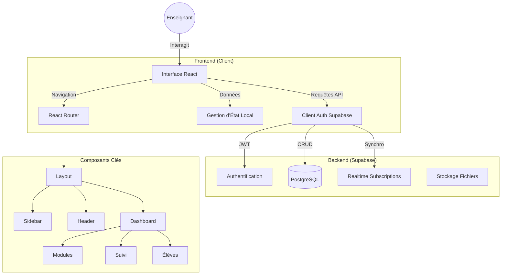

# Architecture du Projet Gestion de Classe

Ce document décrit l'architecture technique de l'application de Gestion de Classe.

## Vue d'ensemble

Le projet est une Single Page Application (SPA) construite avec React et Vite, utilisant Supabase comme Backend-as-a-Service (BaaS).

## Technologies

- **Frontend**:
  - [React](https://react.dev/) (UI)
  - [Vite](https://vitejs.dev/) (Build tool)
  - [Tailwind CSS](https://tailwindcss.com/) (Styling)
  - [React Router](https://reactrouter.com/) (Navigation)
  - [Lucide React](https://lucide.dev/) (Icônes)
  - [DnD Kit](https://dndkit.com/) (Drag & Drop)

- **Backend**:
  - [Supabase](https://supabase.com/)
    - PostgreSQL Database
    - Authentication (Email-based)
    - Row Level Security (RLS) pour la protection des données

## Structure des Dossiers

- `/src`
  - `/components`: Composants réutilisables (Layout, Boutons, Modales...)
  - `/pages`: Vues principales correspondantes aux routes (Dashboard, Auth, Landing...)
  - `/hooks`: Custom hooks pour la logique métier (ex: `useModuleManagement`)
  - `/lib`: Utilitaires et configuration (client Supabase, helpers...)
  - `/config`: Constantes globales (navigation...)
